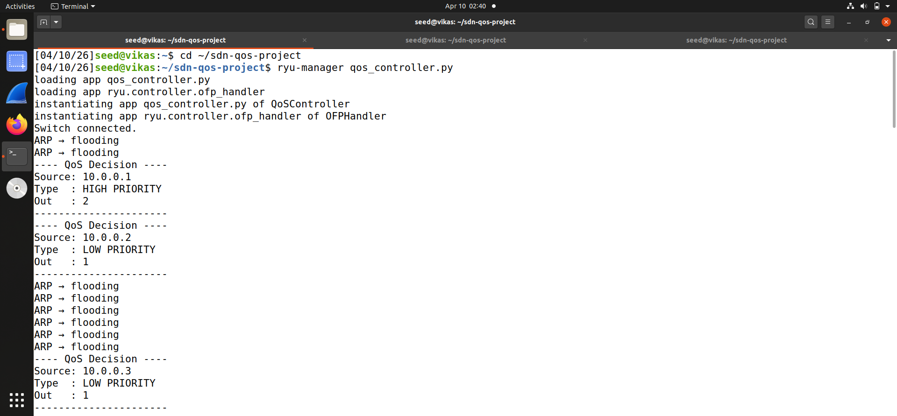
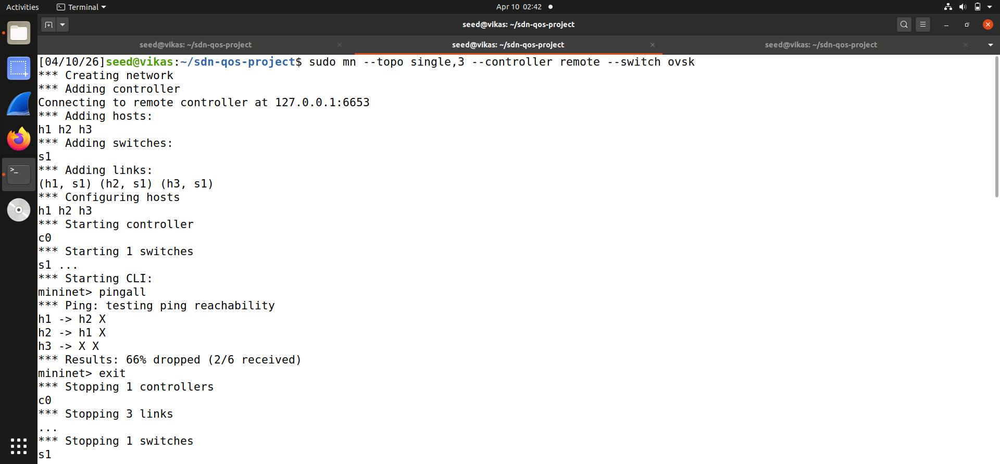
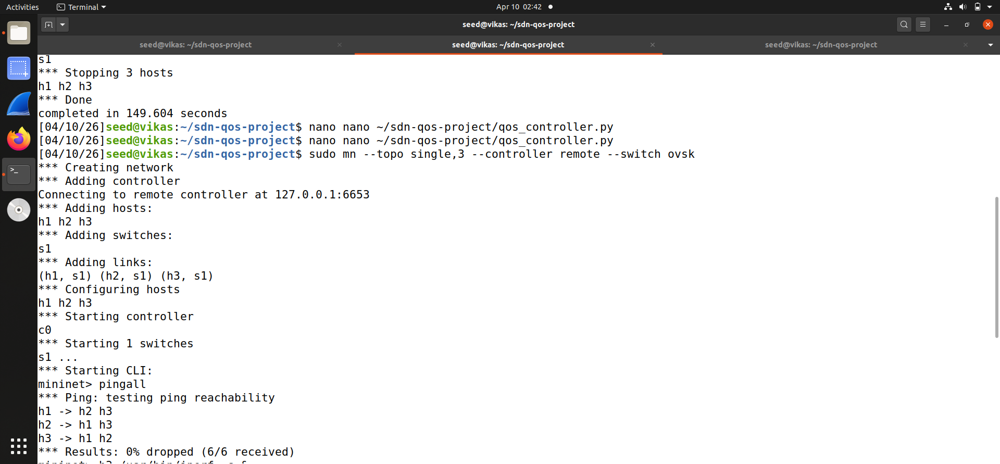
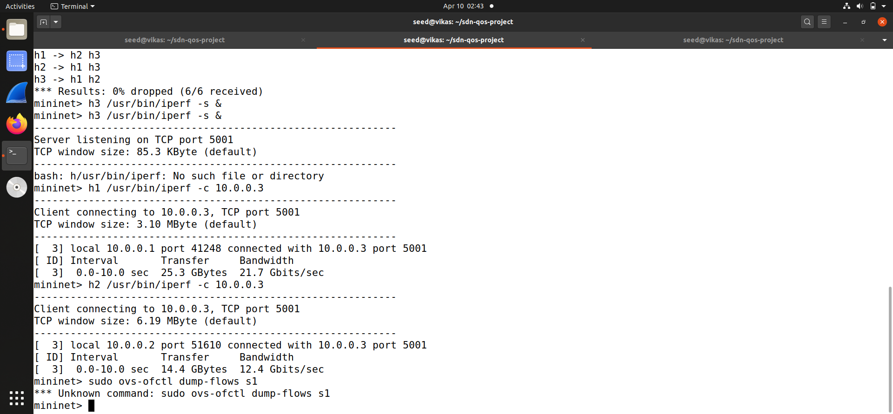
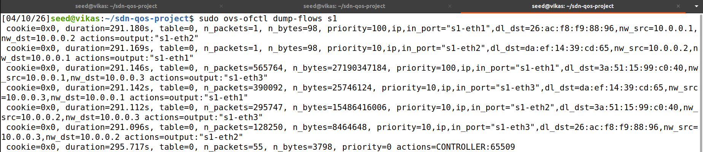

# SDN QoS Priority Controller

A Software-Defined Networking (SDN) project that implements **Quality of Service (QoS)** using **OpenFlow 1.3 meters** via a Ryu controller. Traffic from high-priority hosts gets full bandwidth while low-priority hosts are hard-capped using `OFPMeterBandDrop` at the switch level.

---

## Table of Contents
- [Overview](#overview)
- [Tools & Technologies](#tools--technologies)
- [Network Topology](#network-topology)
- [How It Works](#how-it-works)
- [Setup & Execution](#setup--execution)
- [Results](#results)
- [Project Structure](#project-structure)

---

## Overview

This project demonstrates how an SDN controller can enforce **real bandwidth-based QoS policies** without requiring any hardware-level configuration. The Ryu controller intercepts packets, classifies traffic based on source IP, and installs OpenFlow 1.3 flow rules tied to **OpenFlow meters** into the OVS switch.

>  **Important:** Flow priority alone does **not** limit bandwidth — it only controls which rule matches first. This project uses `OFPMeterBandDrop` to enforce actual rate limits at the switch level, giving `h1` (high-priority) unlimited bandwidth while capping `h2` (low-priority) at **1 Mbps**.

---

## Tools & Technologies

| Tool | Purpose |
|------|---------|
| **Ryu** | SDN Controller (Python-based) |
| **Mininet** | Network emulation |
| **Open vSwitch (OVS)** | Software switch |
| **OpenFlow 1.3** | Flow rule + meter protocol |
| **iperf** | Bandwidth testing |

---

## Network Topology

```
  h1 (10.0.0.1) ─────┐
                      │
  h2 (10.0.0.2) ─── [s1] ──── h3 (10.0.0.3)  [Server]
                      │
              [Ryu Controller]
               (remote, port 6653)
```

| Host | IP | Role | Priority | Bandwidth |
|------|----|------|----------|-----------|
| h1 | 10.0.0.1 | High-priority client | 100 | Unlimited |
| h2 | 10.0.0.2 | Low-priority client | 10 | Capped at 1 Mbps |
| h3 | 10.0.0.3 | iperf server | — | — |

---

## How It Works

### Step-by-step Flow

1. **Switch connects** → Controller installs a table-miss rule (priority 0) that sends all unknown packets to the controller. A **Drop Meter (ID=1)** is also created on the switch with a `1000 kbps` rate cap.

2. **Packet arrives** → `packet_in_handler` inspects the IP source.

3. **Classification:**
   - `src = 10.0.0.1` → priority **100** (HIGH) — **no meter attached**
   - anything else → priority **10** (LOW) — **Meter ID=1 attached**

4. **Flow rule installed** → Match on `(in_port, eth_type, ipv4_src, ipv4_dst, eth_dst)`.
   - HIGH flows: `OFPInstructionActions` only → full speed forwarding
   - LOW flows: `OFPInstructionMeter` → `OFPInstructionActions` → packets exceeding 1 Mbps are **dropped at the switch**

5. **Subsequent packets** → Handled directly by the switch without hitting the controller.

### QoS Enforcement Architecture

```
Packet from h1 (HIGH)
  └─► Match flow (priority=100) → Forward → Full bandwidth ✅

Packet from h2 (LOW)
  └─► Match flow (priority=10) → Meter ID=1 (1 Mbps cap)
           ├─ Within limit  → Forward ✅
           └─ Exceeds limit → DROP ❌
```

---

## Setup & Execution

### Prerequisites
```bash
pip install ryu mininet
# iperf must be installed on the system
```

### Step 1 — Start the Ryu Controller
```bash
ryu-manager qos_controller.py
```

### Step 2 — Launch Mininet Topology
```bash
sudo mn --topo single,3 --controller remote --switch ovsk
```

### Step 3 — Test Connectivity
```
mininet> pingall
```

### Step 4 — Run iperf Bandwidth Test
```
mininet> h3 /usr/bin/iperf -s &
mininet> h1 /usr/bin/iperf -c 10.0.0.3
mininet> h2 /usr/bin/iperf -c 10.0.0.3
```

### Step 5 — Inspect Flow Table and Meters
```bash
sudo ovs-ofctl dump-flows s1
sudo ovs-ofctl dump-meters s1
```

---

## Results

### 1. Ryu Controller — QoS Decisions
The controller logs each flow classification in real time, identifying HIGH vs LOW priority traffic, the meter attached, and the assigned output port.



---

### 2. Mininet — First pingall (Flow Learning Phase)
On the first `pingall`, some packets are dropped as the controller is still learning MAC addresses and installing flow rules (66% drop rate is expected during the ARP/learning phase).



---

### 3. Mininet — Successful pingall (0% packet loss)
After flow rules are installed, full connectivity is confirmed with **0% packet loss** across all 6 host pairs.



---

### 4. iperf Bandwidth Results
Bandwidth test confirms real QoS enforcement via meters:

| Host | Bandwidth | Meter |
|------|-----------|-------|
| **h1** (priority 100) | **Full link speed** | None (unlimited) |
| **h2** (priority 10) | **~1 Mbps** | Meter ID=1 (DROP at 1000 kbps) |

Unlike priority-only approaches, the bandwidth difference here is **enforced at the switch** — not just a scheduling preference.



---

### 5. OVS Flow Table & Meter Dump
The installed flow rules confirm correct priority and meter assignment.



**Key flows observed:**
- `priority=100, nw_src=10.0.0.1 → output:s1-eth3` — h1→h3 (HIGH, no meter)
- `priority=10, nw_src=10.0.0.2 → meter:1, output:s1-eth3` — h2→h3 (LOW, capped)
- `priority=0 → CONTROLLER` — table-miss fallback

**Meter dump (`ovs-ofctl dump-meters s1`):**
```
OFPST_METER reply:
  meter=1 kbps bands=
    type=drop rate=1000 burst=100
```

---

## Key Observations

- **Real bandwidth enforcement** is achieved via `OFPMeterBandDrop`, not just flow priority. Priority alone only determines rule match order.
- The meter is installed **once at switch-connect time** (in `switch_features_handler`), avoiding duplicate meter errors.
- The controller acts as a **reactive** learning switch enhanced with QoS classification — scalable and easy to extend.
- ARP packets are always flooded (not subject to QoS) since they don't carry IP headers.
- Flow rules and meters persist for the session and can be inspected live via `ovs-ofctl`.

---

## Adjusting Bandwidth Cap

To change the low-priority cap, edit the constants at the top of `qos_controller.py`:

```python
HIGH_PRIORITY_IP = "10.0.0.1"   # Host that gets full bandwidth
LOW_METER_ID     = 1             # Meter ID (must be unique per switch)
LOW_RATE_KBPS    = 1000          # ← Change this (in kbps). e.g. 500 = 0.5 Mbps
```

---

## Project Structure

```
sdn-qos-project/
├── qos_controller.py      # Ryu SDN controller with meter-based QoS logic
├── requirements.txt       # Python dependencies
├── run_commands.txt       # Quick reference for all commands
├── outputs/
│   └── flow_table.txt     # Captured OVS flow table output
├── screenshots/           # Terminal output screenshots
└── README.md
```
